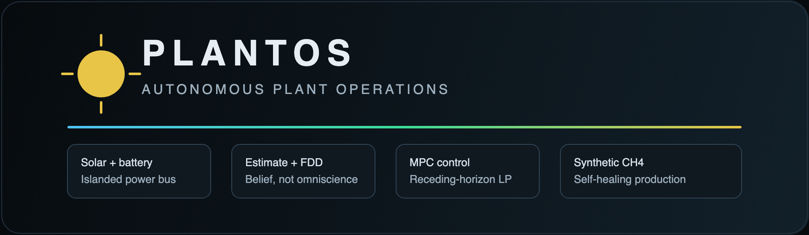
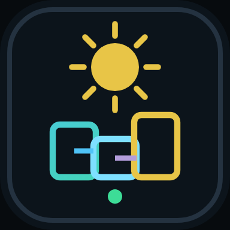
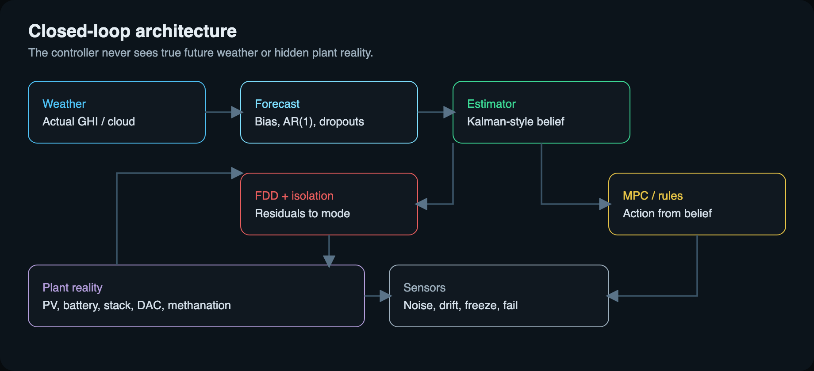

<p align="center">
  
</p>

<p align="center">
  
</p>

<h1 align="center">PlantOS</h1>

<p align="center">
  <strong>Self-healing operations for a solar-powered synthetic-fuel plant.</strong><br />
  Digital twin · receding-horizon MPC · fault diagnosis · live operations console
</p>

<p align="center">
  <a href="https://opensource.org/license/mit"></a>
  <a href="https://www.python.org/"></a>
  <a href="https://fastapi.tiangolo.com/"></a>
  <a href="https://react.dev/"></a>
  
  <a href="https://docs.docker.com/compose/"></a>
</p>

---

PlantOS keeps a remote power-to-methane site **productive when the world disagrees with the plan**: intermittent solar, wrong forecasts, degrading equipment, and sensor faults.

It does not only chase a production setpoint. It **reconfigures** — isolate, derate, hold reserve, recover — so the plant still makes methane instead of waiting for a perfect day.

```
☀️ Weather  →  📡 Noisy forecast
🏭 Plant    →  🧪 Sensors  →  🧠 Estimator  →  🩺 FDD  →  🎯 Controller  →  ⚙️ Actuators
```

## ✨ Highlights

- ⚡ **Physics digital twin** — PV, battery, electrolyser, CO₂ capture, methanation, thermal states
- 🎯 **Receding-horizon MPC** — linear program via [HiGHS](https://highs.dev/) ([SciPy](https://scipy.org/) `linprog`)
- 🌦️ **Imperfect forecasts** — bias, AR(1) noise, and forecast dropouts
- 🩺 **Model-based FDD** — residuals, persistence, competing hypotheses
- 🛡️ **Autonomous recovery** — isolation, derating, graceful operating modes
- 🗣️ **Explainable actions** — machine-readable reason codes plus operator text
- 🖥️ **Operations console** — live compare of naive / rules / PlantOS MPC
- 📊 **Reproducible campaigns** — CLI experiments, Monte Carlo, counterfactuals

## 🧠 Reality vs belief

The platform keeps two worlds on purpose:

| World | What it contains |
|---|---|
| **Reality** | True physics, true weather, injected disturbances |
| **Belief** | Noisy sensors, a Kalman-style estimator, an imperfect forecast |

The controller **never** receives the actual future weather. If it looks clever, it earned it.

<p align="center">
  
</p>

## 🚀 Quick start

```bash
python3 -m venv .venv
source .venv/bin/activate          # Windows: .venv\Scripts\activate
pip install -e ".[dev]" --config-settings editable_mode=compat
pytest -q
plantos simulate --scenario storm --controller mpc
plantos compare --scenario storm
```

### 🖥️ Operations console

```bash
# terminal 1 — API
plantos serve --port 8000

# terminal 2 — console
cd frontend && npm install && npm run dev
```

Open [http://localhost:5173](http://localhost:5173). **Run compare** executes live naive / rules / MPC simulations — not a canned animation.

### 🐳 Docker

```bash
docker compose up --build
```

API on **8000**, console on **5173**.

## 🎮 Controllers

| Name | Emoji | Role |
|---|---|---|
| `naive` | 🌞 | Run process load when solar is present. No forecast, isolation, or recovery. |
| `rules` | 📋 | Reserve, minimum run time, poor-weather starts, scarcity shedding. |
| `mpc` | 🎯 | 24–48 h receding-horizon LP. This is PlantOS. |

## 🧪 CLI

```bash
plantos simulate --scenario storm --controller mpc
plantos compare --scenario storm
plantos monte-carlo --runs 20 --scenario baseline
plantos fault-test --type electrolyser_efficiency
plantos counterfactual --scenario storm
plantos serve --port 8000
```

Scenarios live in [`scenarios/`](scenarios/): **storm**, **cascade**, **baseline**.

Results write to `experiments/results/`. Numbers in the console and CLI come from the simulator for that run.

## 📚 Documentation

| Doc | What’s inside |
|---|---|
| [Technical architecture](docs/TECHNICAL_ARCHITECTURE.md) | Twin, estimator, API, invariants |
| [Control methodology](docs/CONTROL_METHODOLOGY.md) | Naive, rules, MPC formulation |
| [Fault methodology](docs/FAULT_METHODOLOGY.md) | Injection, detection, diagnosis, recovery |
| [Plant model](docs/ASSUMPTIONS.md) | Default parameters and modelling scope |
| [Experiments](docs/EXPERIMENTS.md) | Survival score, storm / cascade / Monte Carlo |
| [Operations console](docs/CONSOLE.md) | Dashboard walkthrough |

## 🏗️ Repository layout

```
backend/plantos/     Python package (physics, control, FDD, API, CLI)
frontend/            React operations console
scenarios/           YAML plant + weather + fault campaigns
docs/                Architecture and methodology
docker/              Backend and console images
experiments/results/ CLI output (generated)
```

## 🔧 Tests

```bash
pytest -q
```

Every simulation step checks power balance, mass balance, SOC limits, ramp limits, and isolated equipment.

## 📦 Dependencies

Runtime packages link to their official sites:

<p>
  <a href="https://www.python.org/"></a>
  <a href="https://numpy.org/"></a>
  <a href="https://scipy.org/"></a>
  <a href="https://docs.pydantic.dev/"></a>
  <a href="https://pyyaml.org/"></a>
  <a href="https://fastapi.tiangolo.com/"></a>
  <a href="https://www.uvicorn.org/"></a>
  <a href="https://typer.tiangolo.com/"></a>
  <a href="https://github.com/Kludex/python-multipart"></a>
  <a href="https://highs.dev/"></a>
</p>

Console:

<p>
  <a href="https://react.dev/"></a>
  <a href="https://vite.dev/"></a>
  <a href="https://www.typescriptlang.org/"></a>
</p>

Dev / deploy:

<p>
  <a href="https://docs.pytest.org/"></a>
  <a href="https://docs.docker.com/"></a>
</p>

Versions live in [`pyproject.toml`](pyproject.toml) and [`frontend/package.json`](frontend/package.json).

## 👤 Author

**TeslaNeuro** — [GitHub](https://github.com/TeslaNeuro)

## 📜 License

MIT. See [LICENSE](LICENSE).

Default plant ratings in `docs/ASSUMPTIONS.md` are a **reference model** for this repository, not manufacturer datasheets.
